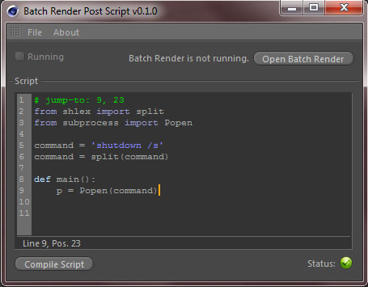

Batch Render Post Script 0.1.1
~~~~~~~~~~~~~~~~~~~~~~~~~~~~~~

This is an open source Python plugin for MAXON's Cinema 4D. It enables you to
run a Python script after Cinema 4D's batch-render is done with rendering.

lil Changelog
-------------

- ``0.1.0``: Initial version
- ``0.1.1``: Internal change, no visible modifications

Features
--------

- Cursor moves to the line with the error if one occurs during compilation. (not R12)
- Load and Save scripts.
- Nice interface.
- ``# jump-to: line, column`` can be added as the first line of a script which will make the cursor position at
  at specified line and column on loading. (not R12)

Requirements
------------

Cinema 4D R12+

=========== ===============================
Author      Niklas Rosenstein
E-Mail      rosensteinniklas@gmail.com
Websize     http://niklasrosenstein.de/
License     BSD 2-Clause
=========== ===============================
